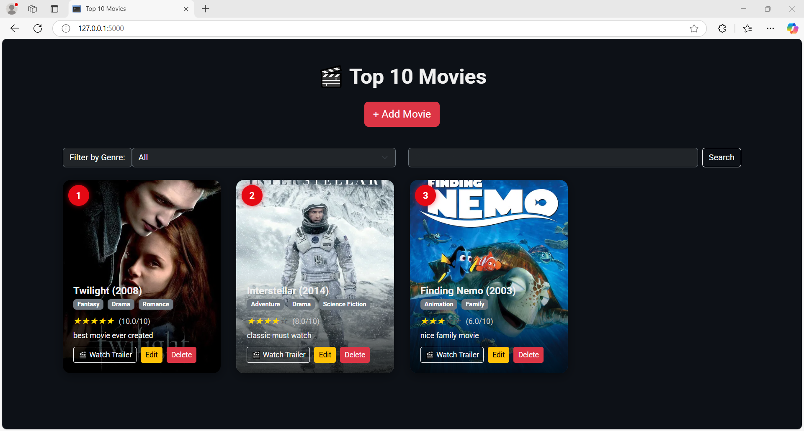
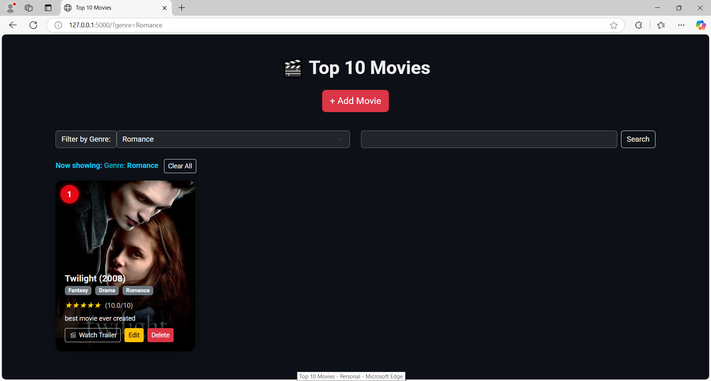
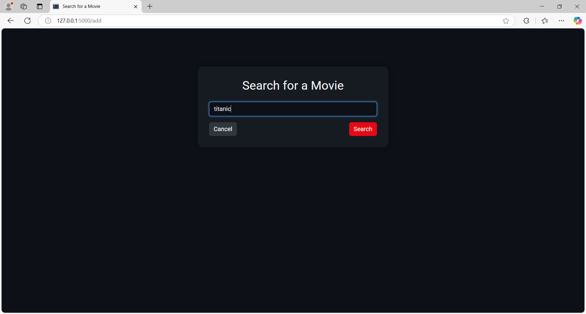
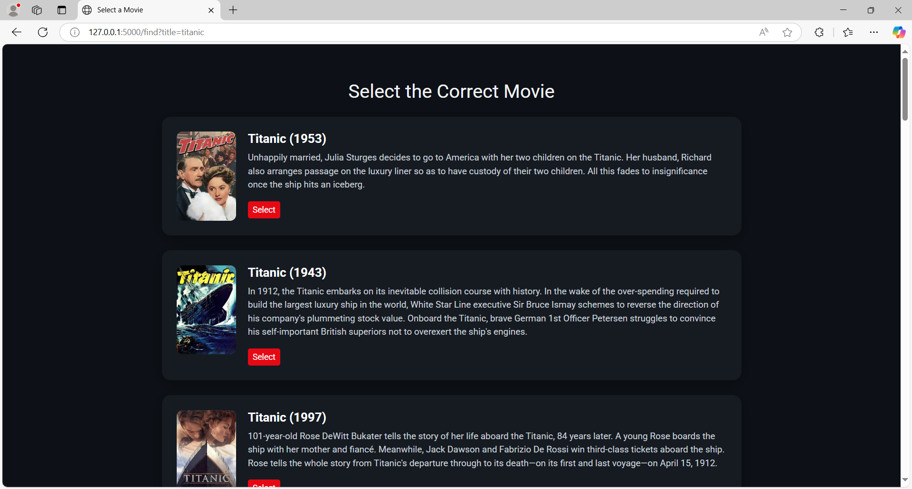
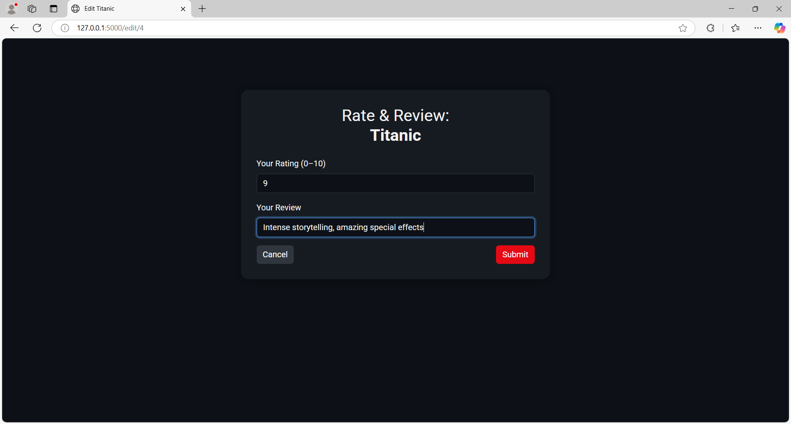

# 🎬 Top 10 Movies App

A professional movie manager built with Python, Flask, and the TMDb API.  
Browse, search, rate, and review your top 10 favorite movies — all saved to a local database with a sleek, interactive UI.

---

## 🌐 Web App Version

Looking for the full web version with global styling, responsive design, and deployment-ready structure?  
👉 [Check out the full web app here »](https://github.com/Cyber-Security-Tech/top10-movies-web)

---

## 🎥 Demo


---

## 🚀 Features

- 🔍 **Search real movies** using the TMDb API
- 🎯 **Select and add** movies to your collection
- ✏️ **Rate and review** each movie
- 🌟 **Dynamic star rendering** based on rating
- 🎞️ **Watch trailers** via YouTube integration
- 🎬 **Filter by genre** or search by title
- 🏆 **Auto-ranked** top 10 list based on rating
- 🛠️ Built with **Flask, SQLAlchemy, and Jinja2**

---

## 📸 Screenshots

| Homepage | Genre Filter | Add Movie | Movie Selection | Edit Review |
|---------|---------------|-----------|-----------------|-------------|
|  |  |  |  |  |

---

## 🛠 Tech Stack

- **Backend**: Flask, SQLAlchemy, Flask-WTF
- **Frontend**: HTML5, Jinja2, Bootstrap 5
- **APIs**: TMDb (The Movie Database)
- **Extras**: .env config, Flask filters, responsive layout

---

## 🧠 What I Learned

This project showcases real-world backend development with frontend integration:

- How to integrate third-party APIs (TMDb) into a Flask app
- Structuring a modular Python project with separation of concerns
- Using Flask-WTF for secure, validated forms with CSRF protection
- Implementing filters, search functionality, and dynamic rankings
- Clean Jinja templating and responsive visual UI patterns
- Building the foundation for scalable, deployable Flask apps

---

## 📦 How to Install Locally

```bash
# 1. Clone the repo
git clone https://github.com/Cyber-Security-Tech/top10-movies
cd top10-movies

# 2. Create a virtual environment
python -m venv venv
source venv/bin/activate        # On Windows use: .\venv\Scripts\activate

# 3. Install dependencies
pip install -r requirements.txt

# 4. Set up your environment variables
cp .env.example .env
# Then open .env and add your TMDB_API_KEY and FLASK_SECRET_KEY

# 5. Run the app
python app.py
```

---

## 📁 Project Structure

```
top10-movies/
├── app.py
├── models.py
├── forms.py
├── tmdb_api.py
├── requirements.txt
├── .env.example
├── templates/
│   ├── index.html
│   ├── add.html
│   ├── select.html
│   └── edit.html
├── static/
│   └── (optional for global styling)
├── media/
│   ├── demo/demo.gif
│   └── screenshots/
│       ├── home_page.png
│       ├── genre_filter.png
│       ├── add_movie.png
│       ├── select_results.png
│       └── edit_movie.png
```

---

## 🔮 Future Improvements

- 👥 Add user accounts with login/favorites
- ☁️ Use PostgreSQL or MongoDB for production
- 🧾 Export movie list to CSV or PDF
- 🌍 Deploy the app with Render or Fly.io
- 🧠 Add AI-based movie recommendations

---

## 📌 Project Status

> 🛠️ **Note:** This is the backend-focused version of my Top 10 Movies project.  
> ✅ A more advanced, full-stack **[Web Version](https://github.com/Cyber-Security-Tech/top10-movies-web)** with global styling, streamlined routes, and deployment features is also available.

This version is complete and serves as a showcase of:

- API integration with TMDb
- Backend architecture with Flask & SQLAlchemy
- UI rendering using Jinja2 templates
- Features like filtering, search, star ratings, trailer links, and local data storage

✅ Use this as a base for:
- Building a frontend-optimized web app  
- Adding user authentication (login, favorites)  
- Switching to PostgreSQL or MongoDB for production  
- Full-stack deployment (see web version above)